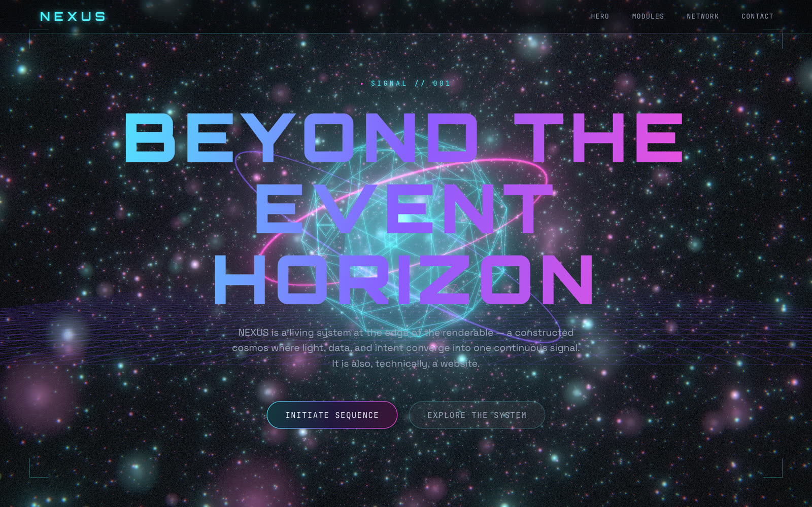
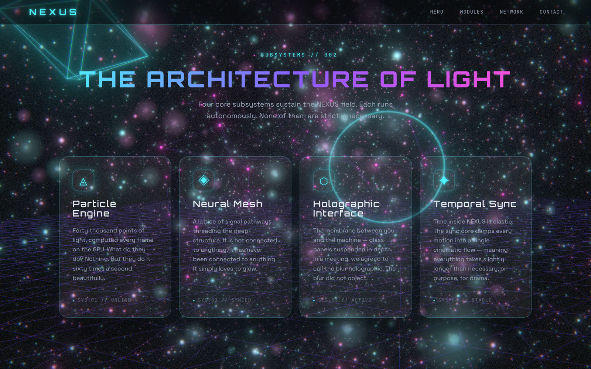
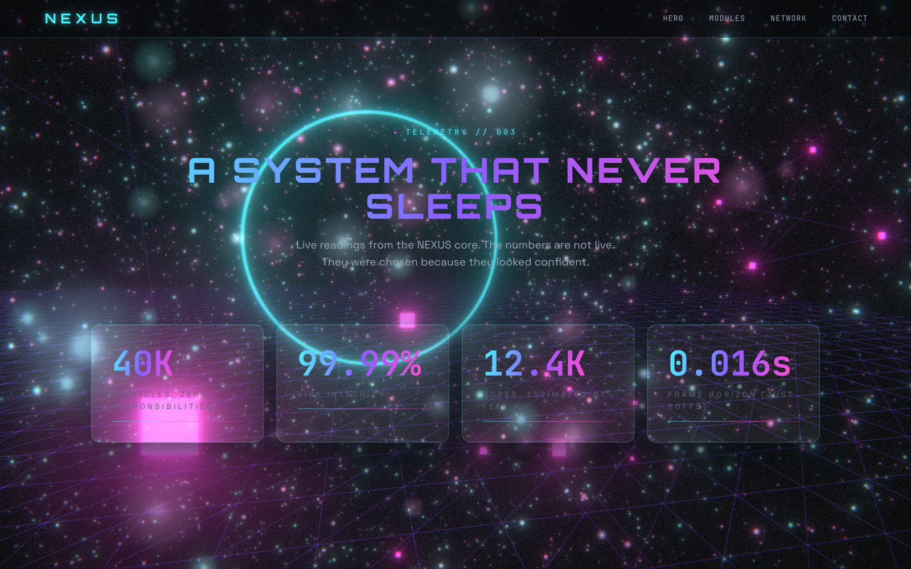
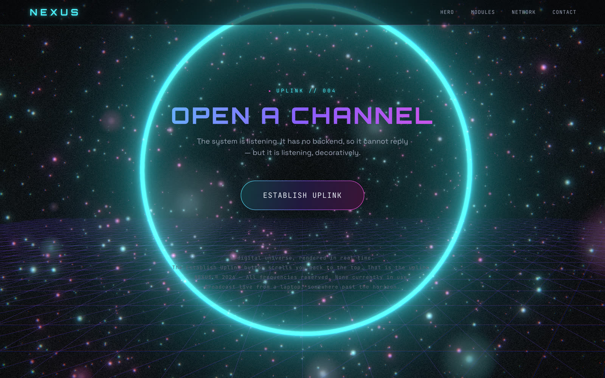

# NEXUS — Fable 5 にサイトを丸ごと作らせた記録

**Live:** https://uzuchan.github.io/NEXUS/

Claude Fable 5 がローンチされたので、性能を確認するためにこのアプリを作った。私がやったのは**要件定義**。実装は Claude(オペレーター)が **10体のサブエージェント**を編成して並列で行い、QA エージェントの監査とブラウザ実機検証まで含めて**半日で公開可能な状態**になった。

Three.js の GPU パーティクル(4万点)、UnrealBloom、スクロール連動のシネマティックカメラ、グラスモーフィズム UI。フレームワークなし、Vite + vanilla ES modules のみ。



<p align="center"></p>

<details>
<summary>各セクションのスチル（modules / network / contact）</summary>





</details>

---

## 記録に残っていた開発タイムライン

Claude Code のセッションログ(`.jsonl`)とファイルのタイムスタンプから復元した実測値。

| 時刻 (JST) | 出来事 | 記録元 |
| --- | --- | --- |
| **2026-06-11 07:45** | セッション1開始 = **作り始め**。要件定義を投入 | セッションログ |
| 07:53 | プロジェクト scaffold(package.json 生成) | ファイル mtime |
| 07:45〜12:57 | Wave 1〜3: **サブエージェント10体が並列実装**。この間の人間の入力は **2メッセージ** | ログ(subagent 起動 10 回) |
| 12:59〜14:00 | QA ループ: Agent 10 監査 → BLOCKER 1 / WARN 3 / NIT 6 を全修正 → headless Chrome 実機検証(ツール呼び出し69回) | セッションログ |
| **2026-06-11 14:00** | リリース可能。CLAUDE.md に次セッションへの引き継ぎを記録 | ログ + mtime |
| 2026-06-12 | GitHub 公開、GitHub Pages 自動デプロイ構築、サイトコピーを真顔コメディへ改稿 | git 履歴 |

**実働について正直に書くと**: 開始から完成まで壁時計では6時間15分。ただし人間(私)が送ったメッセージは2セッション合計 **8通**で、中身は要件定義と途中の確認だけ。サブエージェントが並列で書いている間、人間は待っているか別のことをしているので、**人間の実働は1〜2時間**というのが体感に近い。

## 作り方(再現手順)

1. **要件定義を「契約」として書く** — `CLAUDE.md` に技術制約(追加ライブラリ禁止、postprocessing は three/addons のみ等)、アートディレクション(色・動き・60fps)、そして**モジュール契約6か条**(誰が何を所有し、何に触ってはいけないか)を明文化する
2. **エージェント編成表を作る** — 10体それぞれに所有ファイルと役割を割り当てる。**所有ファイル以外は編集禁止**
3. **オペレーター(メインセッション)が Wave で並列指示** — Wave 1: 基盤(トークン/SceneManager)→ Wave 2: 視覚(パーティクル/環境/PostFX/カメラ)→ Wave 3: UI/インタラクション/文言。統合(main.js)はオペレーター自身が所有
4. **QA エージェントが監査** — ビルド検証・契約違反チェック・console エラー。指摘は BLOCKER/WARN/NIT に分類され、オペレーターが各所有エージェントへ差し戻す
5. **headless Chrome でスクリーンショット実機検証** — コード監査では絶対に見つからないバグがここで出る(後述)
6. **CLAUDE.md に Session Handoff を書く** — 次のセッション(次の私、次の Claude)が状態をゼロから探索しなくて済むように

## 細かい設計

ファイル所有権(抜粋。全文は [CLAUDE.md](./CLAUDE.md)):

| Agent | 所有ファイル | 役割 |
| --- | --- | --- |
| Design System | styles/tokens.css, base.css | ネオン×ダークのデザイントークン体系 |
| Scene Core | core/SceneManager.js | renderer/camera/loop/register API |
| Particle FX | fx/Particles.js | 4万点 GPU パーティクル(custom ShaderMaterial) |
| Environment | fx/Environment.js | 浮遊する抽象3D構造体 |
| PostFX | fx/PostFX.js | UnrealBloom 中心の後処理 |
| Camera Director | motion/CameraDirector.js | スクロール連動カメラドリー |
| Holo UI | styles/ui.css, index.html | グラスモーフィズムカード、HUD |
| Interaction Lab | ui/interactions.js, interactions.css | カスタムカーソル、磁性ホバー、3D tilt |
| Narrative | content/copy.js | サイト文言(英語、SFトーン) |
| QA / Integration | (read + report) | ビルド検証、契約違反チェック |

契約の核は「**camera の位置を所有するのは CameraDirector だけ**」「**CSS はトークン変数しか参照しない**」のような排他的所有権。これが効いた実例: カメラドリーが3Dオブジェクトを貫通するバグが出たとき、Environment は camera を**読むだけ**でコアを dissolve する修正になった。契約があるから、修正がスパゲッティにならない。

QA とブラウザ検証で実際に出たバグ(コード監査では不可視だったもの):

- **パーティクル白飛び** — 加算合成スプライト×bloom でパラメータ次第で画面全体が白になる。スクリーンショット検証でしか発見できなかった
- reveal アニメーションの transition が 3D tilt の transform を捕捉して**ホバーが凍結** — 2つのエージェントの成果物が干渉する統合バグ
- WebGL 非対応環境で**画面が白紙** — フォールバック順序の設計ミス

## 思想 — なぜ，こうやって作るのか

### エフェクトを人間が一から書く時代ではない

正直なところ，パーティクルのようなエフェクトを，JavaScriptやGLSLを使って人間がゼロから実装するのはかなり大変だと思う．4万個のパーティクルを動かすシェーダーを書き，bloomをかけても画面が破綻しないように輝度のバランスを調整する．そこまでを手作業で仕上げようとすると，膨大な時間がかかる．

それなら，AIに複数のバリエーションを生成させ，人間が実際に見て選べばいい．これから人間が担うべきなのは，すべてを一から実装することではなく，「どの表現を採用するのか」というデザイン上の意思決定なのだと思う．

### 課題はセキュリティ．ただし，AIだけの問題ではない

生成されたコードが安全かどうかは，これまで以上に慎重に検証する必要がある．ただし，これは単純にAIだけの問題ではなく，AIを利用する人間側の設計や運用の問題でもある．

たとえば，攻撃者役のAIにアプリケーションへのセキュリティテストを実行させることもできる．プロジェクト全体を継続的に監視するマネージャー役のAIを置けば，コードの重複や責務の混在を検出し，スパゲッティコードになるのを防ぐこともできる．

レビューやテスト，監査を開発プロセスの中に組み込むことは，人間の役割だ．AIが生成したものを無条件に信用するのではなく，どのような体制で検証するかまで含めて設計しなければならない．

### 人間が担ってきた「役割」をAIに割り当てる

Anthropicの講演などを見ていると，限られたOpusのトークンを効率よく使いながら，開発，セキュリティ，テスト，進捗管理といった，大規模プロジェクトで人間が担ってきた役割をAIエージェントに割り当てる方法が紹介されている．

役割と責任範囲を明確に分ければ，短時間でも一定の品質を持つシステムを生成できる．デバッグ担当のエージェントに，関数の関係図，データフロー図，シーケンス図などを出力させれば，人間もシステムの構造を確認しやすい．

AIはプロジェクト全体を読み込み，必要なファイルや関連する処理を自分で探索できる．そのため，開発に参加したばかりの人が，「どこに何のファイルがあるのか」を一つずつ探し回る必要も，少しずつなくなっていくのだと思う．

### 課金は勉強料

最新のAIを理解するには，実際に動かしてみるのが一番早い．そのためには，ある程度の費用を勉強料として支払う必要がある．それでも，私は十分に価値があると思っている．

AIによる自動化の方法を学び，繰り返し作業を減らす．そうして生まれた時間を，自分が本当に取り組みたい研究や創作，アイデアの検証に使いたい．

### 私の日課

夜中は，Claudeをトークンの使用制限に達するまで動かし続ける．制限に達したら，解除される時刻に処理を再開するように設定しておく．

朝にすることは，完成したものを確認し，オペレーター役のAIがどのような指示を出し，各エージェントがどのように実装を進めたのかを読むことだ．

特に知りたいのは，うまくいったプロジェクトが，どのような開発プロセスをたどったのかということだ．オペレーターが仕事をどのように分解し，どの役割をどのエージェントに割り当て，問題が起きたときにどう修正したのか．その過程を自分の目で確かめ，次のプロジェクトに使える考え方を吸収したい．

AIオペレーターの設計から学べることは，本当に多い．

### 私が書くのはループだけ

アイデアを頭の中で蒸発させず，思いついた瞬間に形にする．AIをアイデア帳の延長のような感覚で使えるところが気に入っている．

ただし，単に動くだけのプロトタイプを量産したいわけではない．人間が細かく介入しなくても動き続ける，堅牢なシステムを自動で構築するには，どのような役割分担，検証工程，監視体制が必要なのか．その設計を，これからも最新のAIを使いながら学び続けたい．

そしていつか，世界の中で突き抜けるような，個性と爆発力を持ったエンジニアになりたい．

## 起動

```bash
nvm use 22       # Vite 8 は Node 20.19+ 必須
npm install
npm run dev      # http://localhost:5173
npm run build    # dist/ へ本番ビルド
```

main へ push すると GitHub Actions が自動で Pages へデプロイする。

## 関連ドキュメント

- [CLAUDE.md](./CLAUDE.md) — エージェント契約・編成・Session Handoff(次のセッションへの引き継ぎ)
- [docs/site-copy-ja.md](./docs/site-copy-ja.md) — サイトコピー対訳。英語をちゃんと読むと真顔コメディになっている仕掛けの解説
